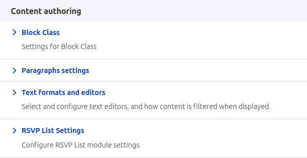
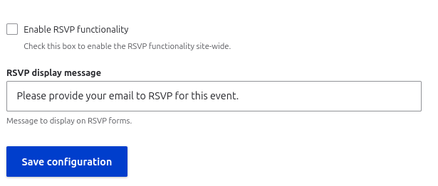
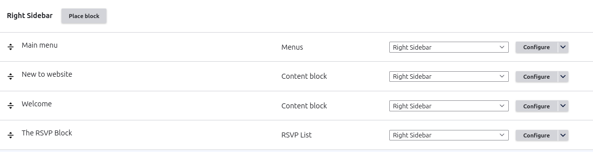
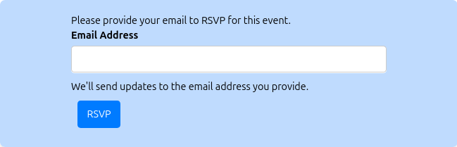

# RSVP Form API

## Overview
The RSVP Form API module provides functionality for site visitors to RSVP to events via a form that collects email addresses. The module includes a configurable form, AJAX submission handling, and an administration interface to enable/disable the RSVP functionality site-wide.

## Features
- AJAX-powered RSVP form for collecting email addresses
- Admin configuration page to enable/disable RSVP functionality
- Customizable display message
- Database storage of RSVP submissions
- Form validation for email addresses
- Seamless user experience with dynamic feedback

## Installation
1. Download and place the module in your `/modules/custom` directory
2. Enable the module through the Drupal admin interface (`/admin/modules`) or use Drush:
   ```bash
   ddev drush en vaibhav_form_api
   ```

## Configuration
1. Navigate to `/admin/config/content/rsvp-list`
2. Toggle the "Enable RSVP functionality" checkbox to enable/disable the RSVP form
3. Customize the display message that appears above the RSVP form
4. Click "Save configuration"

## Usage
The RSVP form can be displayed in two ways:

### As a Block
1. Go to Block layout (`/admin/structure/block`)
2. Place the "RSVP Form" block in your desired region
3. Configure visibility settings if needed

### As a Page
The RSVP form is available at `/rsvp` and can be linked from anywhere on your site.

## Permissions
This module defines the following permissions:
- `administer rsvplist`: Allows users to access the RSVP settings page
- `view rsvplist`: Allows users to view the RSVP form

## Database Schema
The module creates a `rsvplist` table with the following structure:
- `id`: Auto-increment primary key
- `mail`: Email address of the RSVP submission
- `nid`: Node ID associated with the RSVP
- `uid`: User ID of the submitter
- `created`: Timestamp of submission

## Troubleshooting
If the RSVP form is not appearing:
1. Check if the module is enabled
2. Verify that the RSVP functionality is enabled in the configuration
3. Clear the Drupal cache


Initially


Configuration



Enable the form



Add block in the sidebar



Final output



After submitting


