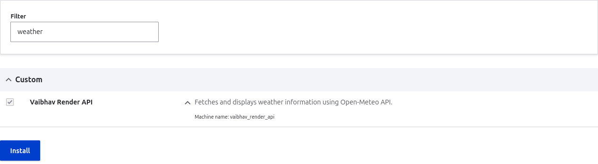
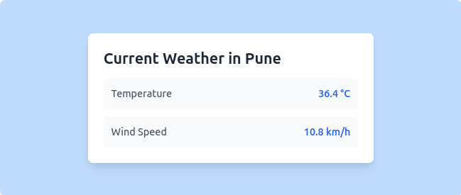

# Vaibhav Render API Module

## Description

This module is a custom Drupal 11 module that fetches and displays real-time weather data for Pune using the Open-Meteo API. The data is displayed on the `/weather` route.

## Features

- Fetches real-time weather data for Pune.
- Displays temperature and wind speed.
- Uses Drupal's HTTP client service for API requests.
- Renders data using a Drupal-compatible theme.

## Installation

1. Place the `vaibhav_render_api` module inside your Drupal installation under `modules/custom/`.
2. Navigate to your Drupal site's Extend page (`/admin/modules`) and enable **Vaibhav Render API**.
3. Clear the cache using:
   ```sh
   drush cr
   ```

## Usage

- Visit the `/weather` route to view the current weather in Pune.
- The module fetches data from the Open-Meteo API without requiring an API key.


## Troubleshooting

- If you encounter any issues, clear the cache using:
  ```sh
  drush cr
  ```

---

  

  
